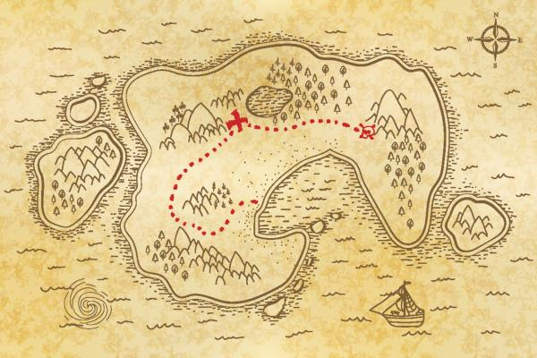

# Welcome to My Projects Session

## TRAIL   
 
<h4>Here you can find my Trail since my very first project.
You can select them by module.</h4>

# SHELLSCRIPT  

 <b>1. Introduction to Shellscript</b>

# INTRODUCTION TO WEBDEVELOPMENT  

   

 1. Introduction to Javascript
 2. Introduction to HTML AND CSS 
 3. Introduction to flexbox and Responsive design
 4. DOM, Events, WebStorage
 5. Introduction to Javascript ES6 and Unit Tests
 6. HighOrder Functions to Javascript ES6
 7. Promises and asyncronous Javascript
 8. Automatized Tests

# FRONT-END       

 1. Introduction to React
 2. Component State, Events and Forms in React
 3. Life Cycle and React Router
 4. Automatized tests with React Testing Library
 5. Manage React Component state with Redux   
 6. Context API AND Hooks.
 
# BACK-END      

1. Introduction to SQL
 
2	 Functions, Joins and Subqueries

3  Normalization and Database modeling (Model)

4  Introduction to Mongodb and NOSQL

5  Mongodb Simple and Complex Update

